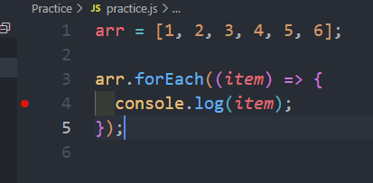

# 7-10 1일차 학습정리

지금까지 파이썬에 익숙했습니다. 그러니 JS로 코딩을 할려니 헷갈리기도 하고 비슷한 듯 비슷하지 않는 부분이 있었습니다.
<br>그래서 지금부터는 JS에 익숙해지기 위해 사소한 부분까지 모두 여기에 기록하고자 합니다.<br>
더불어 git을 사용하는데 어려움이 있어 학습정리를 하는 동안이라도 git에 익숙해지고자 github를 선택해서 학습정리를 하겠습니다.

# 1. 디버깅 사용하기

다른 환경에서 디버깅을 자주 사용했지만 VSCODE에서 사용하는 것은 처음이니 이것부터 정리하고자 합니다<br>개인적으로 디버깅없으면 너무 힘들어서...
<br><br>

- 우선 원하는 브레이크 포인트를 설정합니다.<br>
  

- 왼쪽에 실행 및 디버그 버튼 클릭합니다.<br>
  
  <br>저는 현재 JS디버그로 설정했기 때문에 JS디버그 터미널이 나오고있습니다.

- 실행 및 디버그 버튼을 누릅니다.
  <br>

- Node.js를 선택합니다.(다른 언어를 사용하시는 분은 상황에 맞게 선택하시면 됩니다.)

- 브레이크 포인트에 잘 걸려서 넘어가지 않는 모습을 볼 수 있습니다.
  

# 2. git gist 사용하기

gist란?
코딩을 하는 경우 코드 일부만을 공유하는 일이 생깁니다. (예를 들어 함수)
<br>그런 상황에서 일부 코드만을 간단하게 사용할 수 있는 github의 기능이 바로 gist입니다.

사용 방법은 github와 유사하니 github에 익숙한 사용자라면 문제없이 해결할 것 같습니다.

# 3. var vs let vs const

- var:<br>
  한마디로 이전 문법입니다. 별로 사용하지 않는 것을 추천드립니다.
  <br>
  여러가지가 있지만 바로 문제점부터 말해보자면 var는 재선언이 가능합니다.
  <br>이러한 코드가 있다고 가정했을 때

```
var a = 1;
var a = 2;
console.log(a); // 2
```

재선언 되는 부분에서 오류가 발생하지 않고 a는 2의 값을 가집니다.<br>
물론 의도했다면 문제가 되진 않지만 우리는 코딩을 하다보면 수 많은 변수가 나옵니다. <br>물론 중복이 있을 수 있고요. 그런 상황에서 var는 최대한 피하는 것이 좋겠습니다.

- let:<br>
  let은 var와 역할은 비슷합니다. 다만 재선언이 안됩니다. var보단 좀 더 안정적인 것 입니다.

- const :<br>
  const는 let과 비슷합니다. 다만 값은 변경은 하지 못합니다. 다른 언어와 마찬가지로 말이죠.<br>하지만 const로 선언된 객체의 값은 업데이트가 가능합니다. <br>즉 const에 저장된 값 자체를 변경하는 것이 아니라면 안의 내용을 변경하는 것은 문제가 되진 않는다는 것입니다.'

- 호이스팅 : <br>
  추가로 호이스팅이라는 개념이 있습니다. 함수나 변수는 어디에서 선언이 되더라도 무조건 위에서 선언이 됩니다. 프로그램 실행 시 함수나 변수를 가장 위에서 선언을 먼저해주고 그 다음을 실행하는 형식입니다. 다만 초기화까지는 안됩니다.
