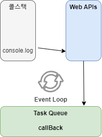

# 비동기 처리에 관하여

JS에서는 싱글스레드 이벤트큐를 활용한 비동기 방식을 취합니다.

### 왜 하필 싱글 스레드??

흔히 생각했을 땐 싱글 스레드는 느리다는 인식이 있습니다. 얼추 맞는 말이긴 합니다. 한번에 단 하나의 동작만을 할 수 있으니깐 말이죠.

그럼 왜 하필 JS에서는 싱글 스레드를 사용할까요?

우선 JS는 웹페이지의 보조적인 기능을 수행하기 위한 브라우저에서 동작하는 경량 프로그래밍 언어입니다.

멀티 스레드를 사용하는 언어는 웹페이지에서 발생하는 동시성의 문제를 해결하기 위해 많은 신경을 써야하지만 싱글 스레드를 사용하면 그럴 필요가 없어 매우 쉬워지겠죠.

### 동시성의 문제

만약 두 명의 사용자가 하나의 게시글에 접근해서 좋아요를 누른다고 가정합시다.

만약 사용자 1이 좋아요를 누르고 웹 내부에서는 좋아요 동작이 발생했으니 좋아요를 1 더하는 연산을 처리합니다.

동시에 사용자 2가 좋아요를 누릅니다.

아직 사용자 1이 누른 좋아요를 미처 처리하지 못했기에 아직 좋아요는 0입니다.

사용자 1이 누른 좋아요를 처리하고 좋아요 1을 게시글에 업데이트했습니다.

곧바로 사용자 2가 누른 좋아요를 처리한 값이 업데이트되는데 이 값 또한 1입니다.

이러한 상황을 경쟁 조건이라고 하며 이를 해결하기 위해서는 세마포어 혹은 뮤텍스 등의 기능을 사용해서 동시성의 문제를 해결합니다.

매우 힘들어지는 상황이 발생하죠

### 너무 느린거 아니야?

동시성의 문제를 쉽게 해결하기 위해 싱글 스레드를 사용한다는 것은 알겠습니다. 그럼에도 불구하고 의문의 계속 남습니다.

쉬운데 느린걸 택하는 것은 아무리 그래도 좀 이상하거든요. 심지어 그걸 해결하기 위한 방법도 나와있는 상태이구요.

그러나 JS는 멀티 스레드를 지원하기보단 이벤트 루프라는 특성을 이용해 이러한 단점을 개선했습니다.

다음부터 나오는 이벤트 관련 내용을 JS에서의 핵심이라고 봐도 무방합니다.

### 이벤트 루프

우선 용어를 정리합시다


- 콜스택 : JS가 처리해야하는 동작을 모아둡니다. 한마디로 코딩을 하고 모든 명령이 콜스택에 쌓인다고 보면 되겠습니다.

- Web APIs: 웹 브라우저에서 제공하는 API로 비동기 작업을 실행합니다.

- Task Queue : 콜백 큐라고도 하며 Web APIs에서 넘겨준 콜백을 저장합니다.

- Event Loop : 콜스택이 비었을 때 Task Queue의 작업을 콜스택에 옮겨줍니다.


여기서 콜스택에 명령이 저장된 상태입니다..


setTimeout은 비동기 실행이기에 Web API가 처리해주게 됩니다. setTimeout의 시간이 지나면 Web API는 setTimeout의 콜백함수를 Task Queue에 전달합니다.



이어 console.log가 실행됩니다.


이벤트 루프는 콜스택이 비어있는 것을 확인하고 Task Queue에 있는 콜백함수를 콜스택에 전달합니다.

콜스택에 저장된 콜백함수는 그대로 실행됩니다.

이러한 방식으로 싱글 스레드의 단점을 개선한 것이 JS가 되겠습니다.

### + libuv

비동기 작업이 중요한 libuv가 있습니다.

간단하게 말하면 비동기 I/O 라이브러리로 비동기 작업이 어떤 커널이 지원하는지 확인합니다.

콜스택에서 setTimeout의 경우 Web API에 전달해서 처리한다고 했습니다.

이 경우 사실 libuv가 개입합니다.

libuv는 콜스택에 쌓인 코드를 확인하고 이를 동기로 처리할지 비동기로 처리할지를 결정합니다.

결정 후 비동기 처리라면 어떤 Web API가 해당 비동기 작업을 수행하는지 확인하고 시스템 API를 사용하거나 스레드 풀에 생성된 스레드에 작업을 위임합니다

### 싱글 스레드에 대한 개인적 오해

제가 공부하면서 가장 이해 안되던 부분이 이거였습니다.

결국 Web API에서 일을 처리한다는 것은 결국 싱글 스레드가 아닌데? 라는 의문이 끊이지 않았습니다.

결론은 JS는 싱글 스레드가 맞습니다. 다만 Web API는 멀티 스레드로 작동합니다.

웹을 예로 들어 말하면 JS는 싱글 스레드가 맞으나 웹 브라우저라는 소프트웨어는 멀티 스레드로 구성됩니다.

여러개의 스레드 중 하나가 JS를 구동하고 있는 것입니다.

또한 Node.js는 멀티 스레드 환경입니다.

위의 그림을 더 자세히 그리면


이런 식의 그림이 완성됩니다.

# 비동기 처리 사용

위에서 설명했듯이 비동기 처리가 어떤 식으로 처리되는지 알아봤습니다.

이제는 비동기 처리를 어떻게 하는지 알아보겠습니다.

### 콜백 함수

콜백 함수란 특정 함수에 매개변수로 전달된 함수를 의미합니다. JS에서는 함수 또한 변수에 저장할 수 있는 객체이니까요.

```
function func() {
  setTimeout(()=>{
    console.log('동작 끝')
  })
}

func();
console.log('다음 작업');
```

위와 같은 프로그램이 있을 때 결과는 다음과 같습니다.

```
다음 작업
동작 끝
```

동기 처리를 하는 프로그램이라면 console.log의 동작 순서가 거꾸로였을 것입니다.

위와 같이 나오는 이유는 func를 실행할 때 setTimeout은 Web API가 처리하고 있고 그 다음 명령으로 넘어가기 때문이죠

그렇다면 저희가 원하는 순서로 나올 수 있도록 바꿔봅시다.

하나의 방법이 콜백 함수를 사용하는 것 입니다.

```
function func(callBack) {
  setTimeout(() => {
    console.log('동작 끝');
    callBack();
  });
}
func(() => console.log('다음 작업'));

```

위와 같이 작성한다면 결과는 다음과 같을 것 입니다.

```
동작 끝
다음 작업
```

콜백으로 넘겨줌으로써 순서를 정해서 처리할 수 있습니다.

즉 비동기에서 콜백을 사용하는 이유는 실행 순서를 정해주기 위해서라고 생각해볼 수 있는 것이죠.

### Promise

콜백 함수의 단점은 가독성이 떨어진다는 것입니다. 흔히 말하는 콜백 지옥에 빠질 수 있는 위험이 있죠


이러한 지옥(?)을 해결하기 위해서 ES6부터 Promise 추가됩니다.

기본적인 문법은

```
let promise = new Promise((resolve, reject)=>{
  // 동작
})
.then(콜백함수=resolve)
.catch(콜백함수=reject)

```

위의 문법에 대해 간단히 설명하면 아래와 같습니다.

- 동작(executor)
  - Promise를 처음 생성되면 실행되는 부분
  - resolve, reject를 호출하는 역할
- resolve
  - 정상 처리되면 value와 함께 호출
- reject
  - 에러 혹은 예외 처리할 때 error 객체와 함께 호출
- then
  - 동작 부분에서 resolve를 value와 함께 호출하면 then의 매개변수인 콜백함수가 실행(콜백함수의 매개변수는value)
- catch
  - 동작 부분에서 reject를 error 객체와 함께 호출하면 catch의 매개변수인 콜백함수가 실행(콜백함수의 매개변수는error)

그래서 위의 동작을 Promise를 통해 재구성해보겠습니다.

```
let promise = new Promise((resolve, reject)=>{
  setTimeout(()=>{
    console.log('동작 끝')
    resolve('다음 작업')
  })
}).then((value)=>console.log(value))
```

사실 위의 코드만 보면 Promise의 장점이 크게 부각이 안 됩니다. 굳이 써야하나? 라는 생각도 들죠

그럼 아래의 예를 비교해보겠습니다.

```
setTimeout(() => {
  console.log(1);
  setTimeout(() => {
    console.log(2);
    setTimeout(() => {
      console.log(3);
    }, 1000);
  }, 1000);
}, 1000);

let promise = new Promise((resolve, reject) => {
  setTimeout(() => {
    console.log(1);
    resolve(2);
  }, 1000);
})
  .then((value) => {
    return new Promise((resolve, reject) => {
      setTimeout(() => {
        console.log(value);
        resolve(3);
      }, 1000);
    });
  })
  .then((value) => {
    setTimeout(() => {
      console.log(value);
    }, 1000);
  });

```

위와 같이 promise를 반환하며 계속 연결되는 것을 프로미스 체이닝이라고 합니다.

위의 코드는 1 2 3을 1초 마다 출력하는 예제 입니다. 어떤가요? Promise가 더 편하다는 것이 느껴지시나요?

솔직히 이 정도의 코드로는 아직까지는 확신이 안 들 수 있습니다. 심지어는 Promise가 더 불편해보입니다. 솔직히 예시로 만들기 위한 억지(?)코드이니까요.

추천드리고 싶은 것은 비동기 문법을 한 번 여러 형태로 사용해보는 것을 추천드립니다. 그럼 더욱 확실해질테니까요.

하여튼 Promise는 콜백함수의 depth가 깊어지는 것을 방지하고자 등장했다는 사실을 알고있습시다.

### Async/Await

ES2016의 Promise는 콜백함수의 지옥에서 빠져나올 수 있도록 해줬습니다. 다만 천국은 아니었나 봅니다.

Promise는 확실히 콜백함수의 단점을 완화시키기 위해 나왔습니다. 다만 then에 콜백함수를 넣어줘야한다는 근본적인 문제는 해결이 되진 않았습니다.

그리하여 ES2017부터는 한층 간결하고 직관적으로 코드 작성할 수 있도록 Async/Awiat를 추가해 프로그래머들을 천국으로 이끕니다.

- async
  - 함수 앞에 작성
- await
  - async로 작성된 함수안에서만 사용

위의 코드를 인용해서 작성해보도록 하겠습니다.

```
const wait = () => {
  return new Promise((resolve, reject) => {
    setTimeout(resolve, 1000);
  });
};
const func = async () => {
  console.log(1);
  await wait();
  console.log(2);
  await wait();
  console.log(3);
};
func();

```

훨씬 간단해진 모습을 볼 수 있습니다.

Promise를 반환하는 함수를 await를 붙여 사용하게 되면 그 함수가 끝날 때 까지 다음 동작을 안하는 것이죠.

장점은 이 뿐이 아닙니다.

위의 예제는 순서대로 진행합니다. 다만 이는 비동기 프로그램의 장점이 아닙니다.

```
function wait(ms) {
  return new Promise((resolve) => setTimeout(resolve, ms));
}

const func1 = async () => {
  await wait(1000);
  return 1;
};

const func2 = async () => {
  await wait(2000);
  return 2;
};
const func3 = async () => {
  await wait(3000);
  return 3;
};

async function func() {
  const results = await Promise.all([func1(), func2(), func3()]);
  console.log(results);
}

func();

```

위의 예제는 순서대로가 아닌 모든 작업을 한번에 처리합니다. 가장 시간이 긴 func3가 반환되어야 비로소 다 같이 반환이 됩니다.

또한 Promise.race()를 사용하면 가장 먼저 작업이 끝난 func1만 반환하게 됩니다.

이렇게 장점이 많은 Async/Await이지만 너무 맹신은 하지 않는 것이 좋습니다.

Promise를 간단하게 사용하기 위해 나온 문법이지 Promise를 완전 대체하는 것이 아니기 때문입니다.

여러 비동기 처리 방식을 익히고 입 맛에 맞게 사용하는 것이 중요하겠습니다.

[참고]

https://ko.javascript.info/async

https://thisisprogrammingworld.tistory.com/99#Promises

https://hanamon.kr/javascript-%EC%BD%9C%EB%B0%B1-%EC%A7%80%EC%98%A5-%ED%83%88%EC%B6%9C%ED%95%98%EA%B8%B0-%EB%B9%84%EB%8F%99%EA%B8%B0-%EC%B2%98%EB%A6%AC-%EB%B0%A9%EB%B2%95/

https://www.youtube.com/watch?v=m0icCqHY39U

# 이벤트

### Event Emiter / 이벤트 핸들러

비동기 프로그래밍의 이벤트 루프와 이벤트 이미터는 다른 개념입니다.

간단히 말하면 Event Loop는 Node.js의 비동기식 동작을 관리하는 역할을 하고있고 이벤트 이미터는 특정 이벤트에 연결된 리스너를 추적합니다.

이벤트 리스너를 등록하면 이미터 객체 내부에 저장됩니다.

각자의 이벤트에 해당되는 핸들러(콜백함수)가 실행되는 구조입니다.

또한 이벤트 이미터를 통해 이벤트 헨들러를 동작시키면 이는 동기적으로 동작합니다.


### Event Emitter 문법

EventEmitter.on(event, ,listener) / .addListener
특정 이벤트가 발생했을 때 호출됩니다.

.once
이벤트가 처음 발생했을 때 수행되고 사라집니다..

.emit
이벤트를 발생시킵니다.

.removelistener / .removeAllListeners
특정 이벤트의 리스너를 제거합니다.

```
const EventEmitter = require('events');
const emitter = new EventEmitter();

emitter.on('event', () => console.log('1'));
emitter.on('event', () => console.log('2'));
emitter.on('event', () => console.log('3'));

emitter.emit('event');
console.log('4');
```

event emitter는 동기적으로 동작합니다. 그래서 emit 후에 바로 4가 출력하는 것이 아닌 1 2 3 4 순서대로 출력하느 것을 볼 수 있습니다.

동기적으로 동작한다라는 것 자체만으로 Event Emitter와 Event Loop는 다르다는 것을 볼 수 있습니다.

[참고]

https://yceffort.kr/2021/06/misconceptions-on-nodejs

# 토론을 하고 난 후

하나의 문제로도 많은 의견이 있을 수 있다는 것을 다시금 느꼈습니다.

개인적으로 아쉬운 점은 이벤트를 실생활에 사용하는 것처럼 더 효율적으로 사용하는 방법을 끊임없이 고민했으나 아이디어가 잘 나오지 않았습니다.

이벤트를 저런 형식으로 사용할 수 있구나란 부분을 알 수 있어 새로웠던 시간이었습니다.

모든 과정이 자연스럽게 끝나는 조건을 어떻게 구현할까 생각하던 중 한 캠퍼분이 재귀호출을 이용해 자연스럽게 종료하는 코드를 봤습니다. 매우 좋은 방법이라고 생각하고 나도 해야지 라고 생각하는 찰나 다른 캠퍼분께서 재귀 호출은 콜스택이 많이 쌓이니 이벤트를 활용해서 재귀적(?)호출하는 방법을 사용했다고 말씀하셨습니다. 사실 이벤트라 재귀적이다라는 표현 자체가 어색하지만 그래도 그런 느낌으로 받아들여 이렇게 적었습니다.

바로 당일 적용해보도록 노력하고 있습니다.

다시금 사람들의 생각은 무한하고 이를 공유함으로써 한 층 더 나아갈 수 있다고 생각했습니다. 저도 하루 빨리 남들에게 도움이 될 수 있는 개발자가 될 수 있도록 노력해야겠습니다.
