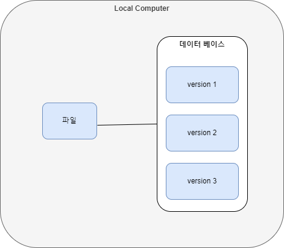

# Git에 관하여

### VCS란

VCS(Version Control System)란 파일 변화를 시간에 따라 기록하고 나중에 특정 시점의 버전을 다시 가져올 수 있는 시스템입니다. 사실 혼자 개발을 한다면 그렇게 필요한 이유는 모르겠지만 협업할 때는 필수적인 프로그램입니다.

### VCS의 종류

- 로컬 버전 관리(Local VCS)
  로컬 컴퓨터의 데이터베이스를 사용해서 파일의 변경 정보를 관리합니다.

  즉 자신의 컴퓨터에서 파일을 관리하는 방식으로 동작합니다.

  대표적으로 RCS(Revision Control System)가 있습니다.

  - 장점

    - 버전마다 파일을 가져올 수 있어 시간단축 가능

    - 파일을 전체 복사하는 것이 아닌 변경된 부분만 복사해서 용량이 적음

  - 단점
    - 로컬에서 관리해서 협업이 어려움
    - 데이터베이스가 문제생기면 복구가 힘듬

- 중앙집중식 버전 관리(Central VCS)
  중앙집중식 버전 관리는 파일을 관리하는 서버가 별도로 존재합니다.

  클라이언트는 서버에 존재하는 데이터를 받아 사용(check out)해서 사용합니다.

  대표적으로는 CVS, Subversion, Perforce가 있습니다.

  - 장점
    - 관리자는 저장소가 하나이기 때문에 전체적인 상황을 관리하기 쉬움
    - 협업이 가능함
  - 단점
    - 중앙 서버에 문제가 생기면 복구 힘듬

- 분산 버전 관리(Distributed VCS)

  분산 버전 관리는 저장소를 히스토리와 더불어 전부 복제합니다.

  대표적으로는 Git이 있습니다.

  - 장점
    - 중앙서버에 문제가 생겨도 클라이언트 pc에 저장된 저장소로 복제 가능
    - 동시에 다양한 그룹과 협업 가능
    - 오프라인에서도 작업이 가능하며 자신의 히스트리 또한 보존 가능

### git과 github

사실 위의 내용은 git을 이해하기 위한 전초단계입니다.

사실 저희가 쓰는 대부분의 VCS는 git이니까요.

우선 git은 위의 DVCS를 기반으로하는 소프트웨어입니다.

그렇다면 github는 뭘까요

github는 git을 지원하는 회사라고 보시면 됩니다.

github의 git저장소를 통해 저희는 git을 사용하고 있는 것이죠.

### git의 구조

[참고] https://uxgjs.tistory.com/182

#### Working Directory

나의 컴퓨터에 저장한 작업 폴더입니다.

실제 사용자의 작업은 이 곳에서 수행됩니다.

이 폴더에는 .git이라는 숨김 폴더가 생김니다.

#### Staging Area

사실 Staging Area는 굳이 필요한가 싶은 공간입니다.

Staging Area을 거치지 않고 그냥 올려도 상관없는데 굳이 Staging Area을 놔두는 이유가 있습니다.

1. 일부분만 커밋할 때

   사실 Working Directory에서 작업하고 모든 파일을 저장하고 싶지는 않을 것 입니다. 메모라던지 기타 프로그래밍할 때 필요했지만 프로그램을 구동하는 부분에 있어서 굳이 필요없는 파일도 있으니까요.

   이런 점에서 Staging Area는 장점이 됩니다.

   우선 Staging Area이 없다고 가정합시다.

   우리가 필요없다고 생각하는 파일을 제외하고 올리기 위해서는 커밋할 때 하나하나 다 지정을 해줘야 합니다.

   그러나 Staging Area가 있다면 그때 그때 커밋하고 커밋한 부분만을 저장하면 되는 것이죠. 굳이 내가 필요없다고 생각하는 파일은 신경 안 써도 되는 것입니다.

2. 충돌 해결
   파일들을 merge할 때 그 중 몇개가 충돌된다고 가정합시다.

   이럴 때 충돌을 해결하기 위한 과정에 필요한 데이터를
   Staging Area 에 올려 안정적으로 사용할 수 있습니다.

3. 파일 수정
   커밋을 하고 파일을 수정할 수 있습니다.

   Staging Area가 없다면 수정을 할 때 마다 새롭게 업로드 해야합니다.

   그러나 Staging Area가 있다면 커밋을 다시 커밋을 함으로써 굳이 업로드를 안하고 수정할 수 있습니다.

이러한 이유로 Staging Area를 사용합니다.

#### Local Repository

개인 PC에 존재하는 저장소입니다.

이곳에 있는 데이터는 Remote Repository에 올라갈 준비를 하고 있습니다.

#### Remote Repository

파일이 원격 저장소 전용 서버에서 관리되며 여러 사람이 함께 공유하기 위한 저장소입니다.

github에 들어가면 있는 Repository를 Remote Repository라고 합니다.

#### 스냅샷

마치 사진을 찍듯이 특정 시점에 스토리지의 파일 시스템을 포착해 보관하는 기술입니다.

간단하게 말해 그 시점의 혹은, 그 버전의 파일을 별도의 파일이나 이미지로 저장하는 것을 스냅샷이라고 하면 됩니다.

#### 파일 관리

- 추적 안함(Untracked) : 관리 대상 아님을 의미합니다.

- 추적함(Tracked): 관리대상의 파일을 의미합니다.
  - 수정 없음(Unmodified) : 변경이 없는 파일을 의미합니다.
  - 수정함(Modified) : 변경된 파일을 의미합니다.
  - 스테이지됨(Staged) : Staging Area에 올라간 파일을 의미합니다.

git의 구조를 설명하고 싶은 글이기에 명령어는 첨부로 대체하겠습니다...

[참고] https://velog.io/@_seeul/TIL14-Git-%EA%B5%AC%EC%A1%B0%EC%9A%A9%EC%96%B4%EC%A0%95%EB%A6%AC

[참고] https://yanacoding.tistory.com/4

# git의 내부

사실 git을 사용하기 위해서는 위의 내용만 알고있어도 무방하다라고 생각합니다. 결국 중요한 것은 사용하는 것이니까요.

하지만 저는 공부를 하는 사람이고 지금 아니면 또 언제해보나 라는 생각으로 정리할까 합니다.

### SHA

SHA는 보안 해시 알고리즘입니다.

해시 알고리즘는 다음과 같은 특징을 가집니다.

- Mathematical : 알고리즘이 수행되는데 있어 엄격한 규칙이 적용되고 이는 깨지지 않습니다.

- Uniform : 모든 문자데이터는 프로그램에서 미리 정한 일정한 길이의 값으로 출력됩니다.,

- Consistent : 알고리즘은 데이터 압축만 수행하고 다른 작업은 수행하지 않습니다.

- One way : 알고리즘에 의해 변형된 데이터는 원래 데이터로 복구 불가능합니다.

SHA는 해시알고리즘 중 하나이며 위의 특징으로 SHA는 보안관련에서 사용됩니다.

[참고] https://sisiblog.tistory.com/317

### git의 내부개체

#### blob

블랍은 Working Directory의 파일에 대응되며 내용이 저장되는 개체입니다.

이 때 파일의 이름이나 형식은 저장되지 않고 오로지 내용을 SHA를 통해 변형하고 변형된 값의 앞 2자로 .git/objectsd의 하위 디렉토리를 만들고 이 디렉토리 안에 나머지 38자를 제목으로 파일를 만듭니다,

이 파일에는 실제 파일의 데이터가 저장되는데 zlib이라는 압축 시스템을 통해 압축된 데이터가 저장됩니다.

즉 실제로 저장되는 것은 파일의 내용만이지 제목, 타입은 저장되지 않습니다.

#### tree

트리는 Working Directory에 대응되는 개체입니다.

트리는 해당 디렉토리 내부의 파일과 디렉토리의 정보를 담은 블랍과 트리의 리스트입니다.

#### commit

각기 다른 스냅샷을 저장할 때 누가, 언제, 왜 저장했는지에 대한 정보를 저장합니다.

위의 저장하던 트리를 커밋으로 가르키고 그 정보를 저장합니다.

위에서 회색박스가 blob파일입니다. Working Directory의 내용을 저장합니다.

그 blob들을 가르키고 있는 파란색 박스가 트리입니다.

쉽게 말하면 그 당시의 스냅샷을 저장하고 있다고 보면 됩니다.

마지막으로 맨 왼쪽 노란색 박스가 스냅샷을 가르키고 있는 commit입니다. 언제 왜 스냅샷을 저장했는지에 대한 정보가 저장됩니다.

그냥 add, commit push만 할 줄 알았지 사실 내부가 이렇게 되어있는지 처음 알았네요 .

사실 이것보다 더 복잡하게 저장되어 있을 줄 알았는데 생각보다 간단해서 놀라기도 했습니다.

추가적으로 읽어보고 싶은 책 중에 `Do it! 지옥에서 온 문서관리자 깃&깃 허브 입문`이라는 책이 있는데 챌린지 과정이 끝나면 읽어봐야겠습니다.

# 개선 후 논의 사항

### 타입스크립트

타입스크립트는 변수의 타입을 지정함으로써 알 수 없는 에러를 예방하고 또한 함수를 사용할 때 타입에 맞는 함수만 나와 코딩할 때 매우 편리

또한 타입이 없는 언어는 개인 개발에서는 매우 편리하지만 협업의 관점에서 보면 가독성이 낮고 분석하기 힘든 부분이 꽤 큼

이러한 점에서 타입스크립트는 가독성을 올려주고 협업하는 부분에 있어서 자바스크립트보다 더 좋은 효과를 보임

그래서 어차피 해야할거 지금부터 많이 연습을 해서 익숙해져야한다.

### 비동기 / 동기

이번 과제는 fs를 사용하는 부분이 많았음

그래서 모두 Sync가 포함된 함수를 사용했음

근데 비동기 프로그램에 익숙해지기 위해서는 단순히 Sync가 포함된 동기 모듈을 사용하는 것이 아닌 간단한 것 부터 promise, async/await를 사용해서 익숙해지고 공부하는 것이 좋음

그래서 시간이 있으면 Sync 모듈을 사용하던 부분을 전부 async/await를 사용해서 개선해보는 것도 좋은 공부가 될 수 있을 것.
